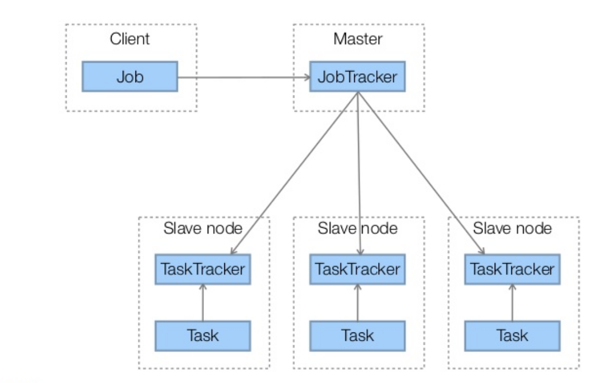

# My MapReduce implementation, in Java


## Goal
The goal of this project is to implement in Java a "word count" in MapReduce. The "word count" is a program aiming to count the occurrences number of each word of a file, and the MapReduce implementation do these operations into distributed computing on a cluster of machines.


  

The MapReduce is running into a simple network architecture: a Master and several Slaves (Workers). Master role is to manage and launch programm remotly. Workers role is to run tasks launched by the Master.


## Architecture and configuration

Code is separated in two jars, one Master.jar on the master machine. Slave.jar on each slave machine.

Code can be launched by a client:

  
*(do not take into account what's written in rectangles 'Job', 'JobTracker' etc, the aim of this picture is to show the client/master/slaves architecture)*

Network communications are done through the SSH protocol.

For SSH connections, it is necessary to generate RSA keys so that the master can control slaves without password. In this configuration, it is easy to do since all machines share the same file-system.

I also created RSA keys, so that I can control all machines from my personal computer, the 'client' machine.

I created a shell script to launch quickly some commands on remote computers (scp transfers, git commands, run commands etc).

Some configuration parameters are stored in Config classes so that it is simple to manage, for instance:
- max number of threads per machine
- number of lines per block
- jars location on machines
- job generated files locations on machines


### Steps

#### Master Side:

**Initialization step :** the master checks which machines are up and responding.

**Clean import step :** the master loads the specified file and cleans it (special characters and empty lines).
```
Hello all this is an example of
input of many lines
..
..
..
There's some special characters!
```
becomes:
```
hello all this is an example of
input of many lines
..
..
..
theres some special characters
```

**Input splitting step :** the master split the file by blocs. Each bloc is send to the mapper worker for the next step.
The file's name syntax : "Sx", where x is a counter.

The number of lines per block is defined in the Config class.

A `Sx` file can contain:
```
hello all this is an example of
block of two lines
```

**Send Mapping Orders step :** each "Sx" bloc is sent to a worker to be mapped into an unsorted map "Umx".

If there are too many map operations to be computed in comparison to the number of responding machines, orders are sent by batch.

By default, I defined a maximum of 4 simultaneous jobs by machine (can be changed in Config class). So the master send 4 orders by machine (if there are 10 machines responding, 40 jobs are sent). The master waits for 3 seconds (timeout can be changed in Config class) and the launch an other batch.
If a job doesn't respond after 3 seconds, it is killed and launched back in the next batch.


The resulting `Umx` can be:
```
hello 1
all 1
this 1
is 1
an 1
example 1
of 1
block 1
of 1
two 1
lines 1
```

Note that the two `of 1` are kept separated.

**Suffling step :**

The `Umx - [keys]` dictionnary is reversed, into a `Key - [Umx]` dictionnary.

Then corresponding commands are prepared for slaves.

**Send Reducing Orders step :** the master sends orders and each reducer worker sum all the counters of the last step and sends to the master the number of occurence of each word (key), with key and number separated by a space.

For instance, this can be sent by the slave:

*Rm1*
```
car 4
```
*Rm2*
```
hello 2
```

**Result step :** it's the last step, the master merges all the Rm files in one, orders words by decreasing number of occurences and writes it.

It then prints two results:
 - one raw result
 - one result with some common words sorted. (for example `the`, `a`, `an` etc..)

*Result :*
 ```
 hello 26
 all 14
 this 10
 is 5
 an 5
 example 3
 ..
 ..
 ```


#### Slaves side

Slaves can handle two types of commands:
 - modeSXUMX for mapping operations
 - modeUMXSMX for reducing operations

## Specificities

If a Slave doesn't respond after specified timeout, command is launched in next batch of commands.

If more than 4 SHH connections are launched on the same machine, SSH connections are closed by the slave. That's why the default value I chose is 4.

## How to run
From the folder containing the MASTER.jar file:
```
 - java -jar MASTER.jar input_file.txt
```

### Requirements

**Network:**

Generate RSA keys so that the Master machine can control Slave machines without hard-coded passwords.

In the same folder as Master.jar, there must be a text file with hostnames of machines to control (Slaves).

**Configuration checks**

Check in Config classes, that jars locations are set according to where you put files on your computers.

Check also that ssh connection credentials are well set (Id file location and username).

### Examples

You can find in the log folder some outputs for different input files:

Parameters were:
```
 - max_thread_per_machine = 4
 - timeout = 3
 - test_timeout = 3
 - lines_per_split = 1
```

You can see when commands failed and were launched another time:
```
-------
ERROR: machine C129-07 commande: cd /cal/homes/lbinet/workspace/Sys_distribue;java -jar SLAVE.jar modeUMXSMX conformément SM1145 Um251 Um191 Um173 Um247 Um236 Um30 Um240 Um102
=> New try
------
```


## Tree view

### Source code
```

├── MASTER
│   └── src
│       ├── main
│       │   ├── Config.java
│       │   ├── Main.java
│       │   └── Utils.java
│       ├── network
│       │   ├── CheckMachinesUp.java
│       │   ├── SshCommand.java
│       │   └── StreamReader.java
│       └── wordcount
│           ├── CleanImport.java
│           ├── MapOrder.java
│           ├── ReduceCommandsPreparation.java
│           ├── ReduceOrder.java
│           ├── Result.java
│           ├── ReverseIndex.java
│           ├── Split.java
│           └── WordCount.java
├── SLAVE
│   └── src
│       ├── main
│       │   ├── Config.java
│       │   ├── Main.java
│       │   └── Utils.java
│       └── operations
│           ├── Mapping.java
│           └── Reducing.java

```
### Files created during Job
```

├── Jobs
│   ├── Result
│   ├── Rmx
│   ├── Smx
│   ├── Sx
│   └── Umx

```
### Others
```
├── Input
│   ├── Input.txt
│   ├── deontologie_police_nationale.txt
│   ├── domaine_public_fluvial.txt
│   └── forestier_mayotte.txt
├── Logs
│   ├── log-domaine_public_fluvial.txt
│   ├── log-forestier_mayotte.txt
│   └── log-input.txt
├── MASTER.jar
├── README.md
├── SLAVE.jar
├── liste_machines.txt
├── pictures
│   └── MapReduce.png
└── utils.sh
```
## TODO:

  - ability to sort words before reduce operation
  - set machine as OUT if doesn't answer twice
  - set longer timeout if operation doesn't succeed on multiple machines
  - scp operations
  - shuffling algorithm to import
  - add DEBUG mode
  - take into account errors stemming from connection closing because of overload
  - full english translation
  - automatic directory creation and purge
